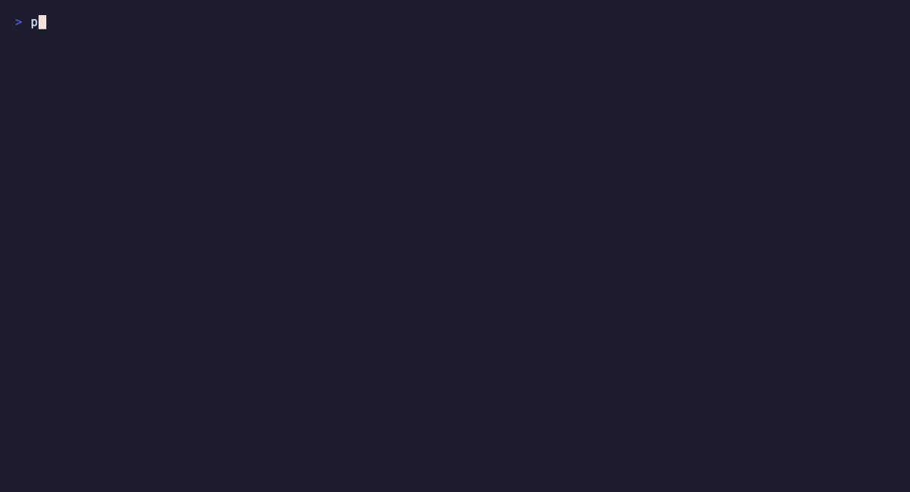

# PolyQL

Translate observability queries across PromQL, LogQL, and vendor DSLs without losing the truth about what changed.

[](go.mod)

[](LICENSE)

[](https://goreportcard.com/report/github.com/ayege/polyql)

[](docs/)




## Contents

- [What PolyQL does](#what-polyql-does)
- [Why it exists](#why-it-exists)
- [Quick start](#quick-start)
- [Installation](#installation)
- [Supported DSLs](#supported-dsls)
- [CLI reference](#cli-reference)
- [Fidelity reporting](#fidelity-reporting)
- [Architecture](#architecture)
- [Extending PolyQL](#extending-polyql)
- [Development](#development)
- [Contributing](#contributing)
- [CNCF alignment](#cncf-alignment)
- [License](#license)

## What PolyQL does

PolyQL translates observability queries between PromQL, LogQL, TraceQL, and extensible vendor DSLs through a shared telemetry IR aligned to the CNCF QLS semantic specification. Every translation includes an honest fidelity report showing exactly what translated fully, what is lossy, and what is unsupported. It is built to answer a simple operational question: “Can I trust this translated query, and if not, why?”

## Why it exists

OpenTelemetry standardized how telemetry is ingested; query languages remain fragmented across metrics, logs, traces, and vendor-specific pipelines. The CNCF Query Language Standardization working group explicitly called out this gap in [cncf/toc#1770](https://github.com/cncf/toc/issues/1770): a common, reusable translation layer is future work that is not solved by the QLS effort itself. PolyQL exists to fill that gap without forcing teams to rewrite every query by hand when they move between backends.

Existing translators are usually single-pair and one-directional: a PromQL-to-LogQL tool, a TraceQL-only emitter, or a dashboard converter living inside a vendor product. PolyQL is different. It is general-purpose, IR-based, and bidirectional. Query languages are described by data rather than by hard-coded compiler branches, so adding a new DSL means a YAML registry plus parser and emitter work instead of editing the core pipeline.

## Quick start

Get a binary, translate a query, and see what it cost you — in under a minute.

```bash
# 1. Install
go install github.com/polyql/polyql/cmd/polyql@latest

# 2. Translate a query
polyql translate --from promql --to logql \
  --query 'rate(http_requests_total{status="500"}[5m])'

# 3. Translate a trace query
polyql translate --from traceql --to logql \
  --query '{span.http.status_code = 500 && duration > 100ms}'

# 4. See what the translation lost, if anything
polyql translate --from promql --to logql \
  --query 'sum by (job) (rate(http_requests_total[5m]))' \
  --format json
```

More ways to use it once you're up and running:

```bash
# Translate a whole Grafana dashboard, panel by panel
polyql dashboard translate \
  --from promql --to logql \
  --input dashboard.json \
  --output translated.json \
  --report report.md --report-format markdown

# Or pull it straight from Grafana (read-only — nothing is written back)
export GRAFANA_TOKEN=glsa_...
polyql dashboard translate --from promql --to logql \
  --grafana-url https://grafana.example.com --dashboard-uid abc123

# Queries can be piped in, so translate composes with everything else
cat queries.txt | polyql translate --from promql --to logql --format query-only

# Use in CI — fail the build if any construct is unsupported
polyql translate --from promql --to logql --file queries.txt || exit 1

# See what languages this binary can read/write, and check a registry directory
polyql registry list
polyql registry validate --dir ./my-registry
```

See [CLI reference](#cli-reference) for the full command surface and exit-code contract, and [Fidelity reporting](#fidelity-reporting) for how to read the report.

## Installation

PolyQL builds to a single static binary with the language registry compiled in — no external services, config files, or network access needed at runtime.

**Go install** (requires [Go 1.25+](https://go.dev/dl/)):

```bash
go install github.com/polyql/polyql/cmd/polyql@latest
```

**Build from source:**

```bash
git clone https://github.com/ayege/polyql
cd polyql
make build        # writes ./bin/polyql
```

**Docker:**

```bash
docker build -t polyql .
docker run --rm polyql translate --from promql --to logql --query 'up'
```

**Verify the install:**

```bash
polyql version
```

## Supported DSLs

| DSL     | Parse | Emit | Status            |
| ------- | ----- | ---- | ----------------- |
| PromQL  | ✅    | ✅   | Stable            |
| LogQL   | ✅    | ✅   | Stable            |
| TraceQL | ✅    | ✅   | Stable            |
| NRQL    | —    | —   | Community welcome |
| DQL     | —    | —   | Community welcome |

**A note on TraceQL round trips.** Translating *within* TraceQL is lossless, and
so is translating a span selector into PromQL or LogQL label matchers. Round
trips *through* another language are not, and are not expected to be: a span set
and a metric series are different things, so the return leg has nothing to
rebuild the dropped half from. Three whole classes of construct have no TraceQL
form at all — arithmetic (a span set is not a number), joins (spans are related
by the trace tree instead), and the time window (Tempo takes its range as
request parameters rather than in the query text). Each is reported rather than
silently dropped, which is the point.

## CLI reference

PolyQL exposes a small command surface for interactive use and automation:

| Command                    | Purpose                                                |
| --------------------------- | ------------------------------------------------------ |
| `polyql translate`          | Translate a single query, a file of queries, or stdin  |
| `polyql dashboard translate`| Translate every panel expression in a Grafana dashboard, read from a file or fetched over the Grafana API |
| `polyql registry list`      | List the languages this binary can parse and emit      |
| `polyql registry validate`  | Check that a directory of language definitions loads    |
| `polyql registry diff`      | Compare a directory of definitions against the built-in set |
| `polyql version`            | Print build info and the languages this binary supports |

Global flags, available on every command:

| Flag              | Purpose                                                          |
| ------------------ | ----------------------------------------------------------------- |
| `--registry-dir`   | Load language definitions from a directory instead of the compiled-in set |
| `-v`, `--verbose`  | Log timing and translation detail to stderr                       |

Exit codes are the CLI's contract with a shell script or CI job — they distinguish "the translation lost something" from "the command couldn't run at all":

| Code | Meaning                                                                 |
| ---- | ------------------------------------------------------------------------ |
| `0`  | Every construct translated fully                                        |
| `1`  | The translation ran but lost something (unsupported, or partial with `--fail-on-partial`) |
| `2`  | The command couldn't run — a query that wouldn't parse, a registry that wouldn't load, an unknown language |

For the full flag set on any command, run `polyql <command> --help`.

## Fidelity reporting

Every translation prints a fidelity report with the raw node-by-node verdicts. The model is intentionally honest:

```text
$ polyql translate --from promql --to logql \
    --query 'sum by (job) (rate(http_requests_total{status=~"5.."}[5m]))'

sum by (job) (rate({__name__="http_requests_total", status=~"5.."}[5m]))

PolyQL fidelity report: promql → logql
────────────────────────────────────────
Total nodes:    8
Full:           6 (75.0%)
Partial:        1 (12.5%)
Unsupported:    1 (12.5%)
Fidelity score: 0.75

FLAGS
  FULL      exact semantic match
  PARTIAL   approximate but explained
  UNSUPPORTED no valid target equivalent
```

The three flags are `FULL`, `PARTIAL`, and `UNSUPPORTED`. A score measures structural fidelity only; it is a hint for comparison, not an automatic verdict. PolyQL tells you what it cannot do, not just what it can.

## Architecture

PolyQL follows a six-stage compiler pipeline: Parse → AST → Resolve → IR → Validate → Emit. The full C4 diagrams live in [docs/](docs/) and the IR model is documented in [docs/c4-level3b-ir-datamodel.mmd](docs/c4-level3b-ir-datamodel.mmd). The data-driven registry is the main extension point: adding a DSL means creating a YAML catalog and matching parser/emitter pair, without changing the compiler core.

The diagrams describe the system PolyQL is aiming at, not only the one that ships today. Anything not yet built — the federation proxy, the OTel exporter — is marked `[PLANNED]` and greyed in the diagrams, and [docs/ROADMAP.md](docs/ROADMAP.md) says what each gap would take to close and which decisions have to be made first. A test in [docs/](docs/) keeps the two in step: it fails if a component marked planned has since been built, which is the direction the drift actually runs.

### Trace concepts in the IR

Spans need three things metrics and logs do not, so the IR names them rather than approximating:

- **`SpansetSelector`** — a data source narrowed by a *boolean* predicate tree. A `Selector`'s matchers are conjunctive, which is all PromQL and LogQL can write between their braces; `{a = 1 || b = 2}` has no conjunctive form, and flattening it would silently change which spans match.
- **`StructuralStage`** — the trace-tree relationships: `CHILD` (`>`), `DESCENDANT` (`>>`), `SIBLING` (`~`). These are *not* joins. A join correlates two sets on values the query names; a structural operator correlates them on the trace structure, which no attribute records — so a target having joins is no help, and QLS §Joins cannot express one.
- **`CoercionStage`** — an explicit cast (QLS §Attributes > Coercion/Casting). Span attributes arrive as text, so comparing one numerically means saying so.

Two further points shape how TraceQL maps on:

- Scope prefixes are resolution context, not structure. An attribute key carries its own scope — `span.http.status_code`, `resource.service.name`, or a bare intrinsic such as `duration` — which keeps the IR flat and keeps a matcher comparable across DSLs with no scoping at all. Translating into one of those folds the dots to underscores, the same rule OpenTelemetry's Prometheus exporter uses, and the report says so.
- TraceQL has no temporal/group aggregation split. There is no window in the query to aggregate over, so every aggregation collapses across spans and carries `AggScope: GROUP`. A PromQL `sum_over_time` therefore translates as an honest axis mismatch rather than a silent re-axis.

## Extending PolyQL

Adding a query language needs no changes to the compiler core: write a `registry/{dsl}.yaml` definition describing the language's functions, operators, and what it can and cannot express, then pair it with a parser and/or emitter. Validate a definition in progress with:

```bash
polyql registry validate --dir ./my-registry
polyql registry diff --dir ./my-registry
```

The full walkthrough — including the YAML shape and where parser/emitter code hooks in — lives in [CONTRIBUTING.md](CONTRIBUTING.md#adding-a-new-dsl).

## Development

Common tasks, via the [Makefile](Makefile):

| Command              | Purpose                                              |
| --------------------- | ----------------------------------------------------- |
| `make build`          | Build the binary to `./bin/polyql`                    |
| `make test`           | Run the test suite (`go test ./... -race`)             |
| `make lint`           | Run golangci-lint                                     |
| `make roundtrip`      | Run the round-trip fidelity tests                     |
| `make generate`       | Regenerate the embedded registry from `registry/*.yaml` |
| `make dashboard-demo` | Translate the sample dashboard, PromQL → LogQL         |
| `make install`        | Install the binary with version info baked in          |

## Contributing

See [CONTRIBUTING.md](CONTRIBUTING.md) for the contribution path, coding expectations, and release process.

## CNCF alignment

PolyQL is designed as a reusable tool rather than a reference architecture, aligned with the CNCF QLS semantic specification. Its IR data models follow the QLS sections covering data types, metrics, logs/events, spans, profiles, selection, time-based windowing, aggregation, and joins. The project targets CNCF Sandbox submission under TAG Operational Resilience, with the implementation shaped to be a general-purpose translation layer rather than a single-vendor product.

## License

This project is licensed under the Apache License 2.0. See [LICENSE](LICENSE).
